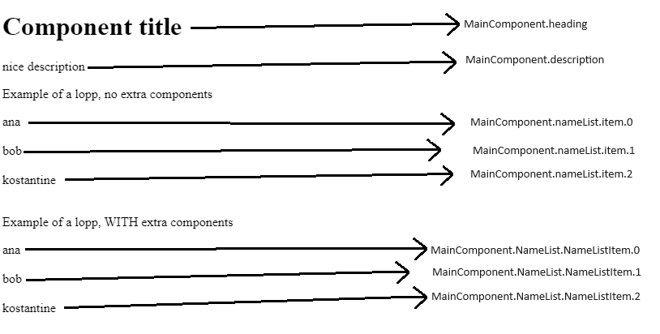

# React アプリケーションにおける data-testid 定義のガイドライン

* [EN](https://github.com/pablohpsilva/data-testid-guidelines/blob/main/README.md)
* [ES](https://github.com/pablohpsilva/data-testid-guidelines/blob/main/README-ES.md)
* [FR](https://github.com/pablohpsilva/data-testid-guidelines/blob/main/README-FR.md)
* [JP](https://github.com/pablohpsilva/data-testid-guidelines/blob/main/README-JP.md)
* [LU](https://github.com/pablohpsilva/data-testid-guidelines/blob/main/README-LG.md)
* [PT-BR](https://github.com/pablohpsilva/data-testid-guidelines/blob/main/README-PTBR.md)
* [RU](https://github.com/pablohpsilva/data-testid-guidelines/blob/main/README-RU.md)

予測可能で、ユニークで、信頼性の高い `data-testid` 属性を作成することは、堅牢で保守可能なテストを確保するために不可欠です。このガイドでは、React（または基本的にどの）アプリケーションにおける `data-testid` 属性の定義に関するベストプラクティス、例、および一般的なパターンを提供します。

## data-testid を使用する理由

- **一貫性**：異なるテストスイート間で要素を一貫して識別する方法を提供します。
- **安定性**：クラス名やテキストコンテンツに比べて変更されにくいため、テストがより信頼性の高いものになります。
- **明確さ**：どの要素がターゲットにされているかを明確に示すことで、テストの可読性を向上させます。

## ベストプラクティス

- **意味のある命名を使用**：要素の目的を反映した明確で説明的な名前を使用します。一般的な名前は避けましょう。
- **主要な要素にのみ適用**：`data-testid` は、テストで直接操作する必要のある主要なインタラクティブ要素に適用します。
- **スタイリングには使用しない**：`data-testid` はテスト専用に使用し、スタイリングやその他のロジックには使用しないでください。
- **ユニークなIDを保つ**：アプリケーション内で `data-testid` の値が重複しないようにします。

## data-testid の定義ガイドライン

- **パスカルケースを使用**（例：`MyComponent`）、要素にはキャメルケース（例：`section`）を使用します。
  - **良い例**:
    - 要素の起源と目的を明確に示します。
    - 特異性を追加し、ユニークで予測可能なものにします。
    - 重複の可能性を減少させます。
    - デバッグのための明確な階層を提供します。
      - 例：`MyComponent.NameList.NameListItem.0.label` は要素の起源と階層を示します。
    - このガイドラインを無視すると、これらの利点を失う可能性があります。
  - **悪い例**:
    - DOMツリーが深くなると名前が長くなる可能性があります。
    - テストを書く際に入力が増えることがあります。
- **拡張可能なシンプルな型/インターフェースを作成**し、コンポーネントに `testId` プロパティを使用します。
  - **良い例**:
    - 再利用可能なインターフェースにより繰り返しを避けます。
    - 未来の変更に自動的に対応します。
    - `data-testid` をサポートまたは必要とするコンポーネントを明確に識別します。
  - **悪い例**:
    - 進行中のプロジェクトでは、この型を多くのファイルに作成し適用する必要があります。
- **特定のコンポーネントプロパティ `testId` を使用**します。
  - **良い例**:
    - 親と子のコンポーネント名を組み合わせることで一意性を確保します。
    - 要素を識別しやすく、操作しやすくします。
  - **悪い例**:
    - `data-testid` 値が長くなる可能性があり、扱いづらくなることがあります。
- **セパレータとして `.`（ドット）を使用**します。
  - **良い例**:
    - 明確な情報の連鎖を提供します。
    - 他のセパレータより視覚的に魅力的です。
  - **悪い例**:
    - 一部の人には好まれないかもしれませんが、顕著な欠点はありません。

## コンポーネントへの data-testid の追加

テストで操作する予定の要素にユニークなテストIDを割り当てることをお勧めします。これらのIDを使用することは、ロケールによって頻繁に変更される可能性のある生のテキストなどの他の属性を使用するよりも信頼性があります。また、アプリケーション全体でユニークなテストIDを使用することで、特定の要素を識別して操作するプロセスが簡素化され、コードの可読性が向上し、コードベースをナビゲートしやすく、保守しやすくなります。

次の例は、ほとんど（すべてではないにしても）可能なシナリオをカバーしており、すべてのベストプラクティスに従っています。

```typescript
import { FC, Fragment, PropsWithChildren } from "react";

type PropWithTestId = { testId: string };

const MainComponent: FC<
  {
    description: string;
    title: string;
    nameList: string[];
  } & Partial<PropWithTestId>
> = ({ testId, description, nameList, title }) => {
  const componentName = testId ?? MainComponent?.name;
  return (
    <>
      <Heading testId={componentName}>{title}</Heading>
      <p data-testid={`${componentName}.description`}>{description}</p>

      <p data-testid={`${componentName}.exampleSimpleLoop`}>
        Example of a loop, no extra components
      </p>
      {nameList.map((name, index) => (
        <Fragment key={name}>
          <span
            data-testid={`${componentName}.nameList.item.${index}`}
          >
            {name}
          </span>
          <br />
          <br />
        </Fragment>
      ))}

      <p data-testid={`${componentName}.exampleComponentLoop`}>
        Example of a loop, WITH extra components
      </p>
      <NameList items={nameList} testId={componentName} />
    </>
  );
};

// This component DOES NOT support being standalone
const Heading: FC<PropsWithChildren<PropWithTestId>> = ({
  children,
  testId
}) => {
  return <h1 data-testid={`${testId}.Heading`}>{children}</h1>;
};

// This component supports being standalone
const NameList: FC<{ items: string[] } & Partial<PropWithTestId>> = ({
  items,
  testId
}) => {
  const componentName = `${testId ? `${testId}.` : ""}${NameList?.name}`;
  return items.map((name, index) => (
    <Fragment key={name}>
      <NameListItem {...{ index, testId: componentName }}>{name}</NameListItem>
      <br />
      <br />
    </Fragment>
  ));
};

// This component DOES NOT support being standalone
const NameListItem: FC<PropsWithChildren<
  { index: number } & PropWithTestId
>> = ({ children, index, testId }) => {
  const componentName = `${testId}.${NameListItem?.name}`;
  return <span data-testid={`${componentName}.${index}`}>{children}</span>;
};
```

上記の例では、すべての可能な data-testid とその動作を明確に見ることができます。次の MainComponent コンポーネントの使用を考慮して、ユニークな data-testid のリストを示します：

```
<MainComponent
  title="Component title"
  description="nice description"
  nameList={["ana", "bob", "kostantine"]}
/>
```

生成された data-testid のリストは次のとおりです：



```
MainComponent.heading
MainComponent.description

// regular loop
MainComponent.nameList.item.0
MainComponent.nameList.item.1
MainComponent.nameList.item.2

// component-based loop
MainComponent.NameList.NameListItem.0
MainComponent.NameList.NameListItem.1
MainComponent.NameList.NameListItem.2
```

## 複数ブロックに data-testid を追加

```
type PropWithTestId = { testId: string }

const MainComponent:FC<{
    description:string;
    title:string;
    nameList: string[]
  } & Partial<PropWithTestId>> = ({ testId, description, nameList, title }) => {
  const componentName = testId ?? MainComponent?.name
  const componentNameSection = `${componentName}.section`;
  const componentNameBlock = `${componentName}.block`;
  return (
    <>
      <section>
        <Heading testId={componentNameSection}>{title}</Heading>

        <p testId={`${componentNameSection}.description`}>{description}</p>
      </section>

      <div>
         {
          names.map((name, index) => (
            <span
              key={name}
              testId={`${componentNameBlock}.nameList.item.${index}`}>
              {name}
            </span>
          ))
        }
      </div>
    </>
  )
}
```

生成された data-testid のリストは次のとおりです：

```
MainComponent.section.heading
MainComponent.section.description
MainComponent.block.nameList.item.0
MainComponent.block.nameList.item.1
MainComponent.block.nameList.item.2
```
